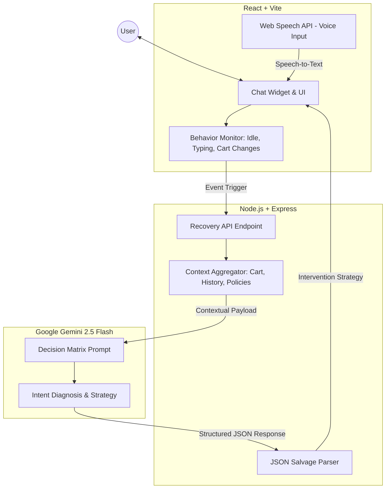

# 🧠 Pragya: AI-Powered Checkout Recovery Agent

[](https://github.com/chandana022005/AI-Checkout-Recovery-Agent)
[](https://github.com/chandana022005/AI-Checkout-Recovery-Agent)

> **"Pragya" (Sanskrit: प्रज्ञा)** — *The highest form of wisdom and discernment.*

Pragya is a proactive, minimal-intervention AI agent designed to rescue abandoned carts by detecting friction at the exact moment of checkout. Unlike generic chatbots, Pragya uses **contextual reasoning** and a **specialized decision matrix** to intervene only when necessary, ensuring a frictionless and premium shopping experience.

---

## 📺 Demo & Presentation

🎬 **[Watch the Demo Video](https://drive.google.com/file/d/1g5rUIif_kIuaVvR61usx_5InN708tAmH/view?usp=drivesdk)**

---

## 🌟 The Problem
Abandoned carts are the biggest challenge in e-commerce, with rates often exceeding 70%. Conventional recovery methods (emails/SMS) are:
- **Reactive**: Sent hours or days after the user has left.
- **Static**: One-size-fits-all discounts that hurt margins.
- **Ignored**: High friction and low open rates.

**Pragya solves this by intervening in real-time, directly on the checkout page.**

---

## 🧠 System Architecture

Pragya operates as a sophisticated bridge between the user's behavioral signals and the brand's business logic.



---

## 🚀 Key Features

### 1. Context-Aware Diagnostic Engine
Pragya doesn't just "chat." It analyzes:
- **Cart Thresholds**: Calculates the exact gap for free shipping.
- **User Intent**: Differentiates between price hesitation, shipping confusion, and idle behavior.
- **Search History**: Leverages past searches to provide personalized product recommendations.

### 2. Intelligent Intervention Strategies
| Strategy | Trigger | Action |
| :--- | :--- | :--- |
| **Shipping Recovery** | User near free shipping threshold (≤ ₹300). | Suggests a relevant low-cost add-on to unlock free shipping. |
| **Value Reinforcement** | User expresses price hesitation. | Confidently explains premium quality and craftsmanship. |
| **Policy Clarification** | User asks about delivery or returns. | Provides precise info based on real-time checkout selections. |
| **Minimalist "Idle" Check** | User is inactive for >20 seconds. | Gentle nudge to assist without being intrusive. |

### 3. Voice-to-Text Integration
Integrated **Web Speech API** allows users to dictate queries hands-free, reducing checkout friction and improving accessibility.

### 4. Robust Engineering
- **Strict JSON Enforcement**: Ensures AI responses are always machine-readable.
- **Salvage Parser**: Advanced backend logic to rescue truncated AI responses, preventing system crashes.
- **Explainable AI**: Every decision includes a `confidence` score and `reasoning` field for transparent auditing.

---

## 🛠️ Tech Stack

- **Frontend**: React 18, Vite, Tailwind CSS, Shadcn UI, Lucide Icons.
- **Backend**: Node.js, Express.
- **AI**: Google Gemini 2.5 Flash / Pro (Generative AI SDK).
- **Communication**: RESTful API, JSON-based State Management.

---

## 📂 Project Structure

```text
AI-checkout-assistant/
├── frontend/           # React + Vite Application
│   ├── src/
│   │   ├── components/ # Shadcn UI & Custom Components
│   │   ├── hooks/      # Voice & Behavior Monitoring
│   │   └── App.tsx     # Main Checkout Experience
├── backend/            # Express Server
│   ├── server.js       # Core Orchestration & AI Logic
│   └── .env            # Configuration
└── README.md           # Project Documentation
```

---

## ⚙️ Getting Started

### 1. Installation
```bash
# Install Backend Dependencies
cd backend && npm install

# Install Frontend Dependencies
cd ../frontend && npm install
```

### 2. Configuration
Create a `.env` file in the `backend` directory:
```env
GEMINI_API_KEY=your_google_gemini_api_key
PORT=3001
```

### 3. Running the Project
```bash
# Start Backend (Term 1)
cd backend && npm start

# Start Frontend (Term 2)
cd frontend && npm run dev
```

---

## 👥 The Team

- **Chandana S** - *AI & Backend Lead*  
- **Hitendra S** - *Frontend & Integration Lead*  

*Developed for the KASPARRO Agentic Commerce Hackathon.*

---

**Pragya** - *Turning Checkout Friction into Conversions with AI Wisdom.*

